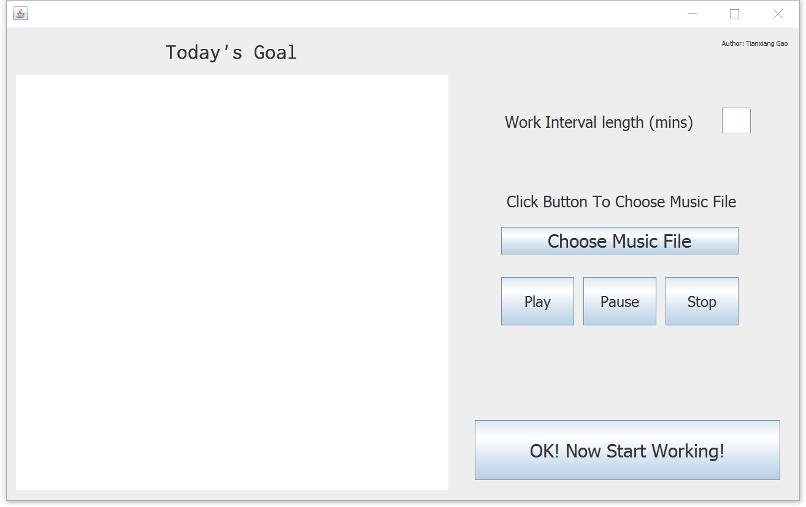
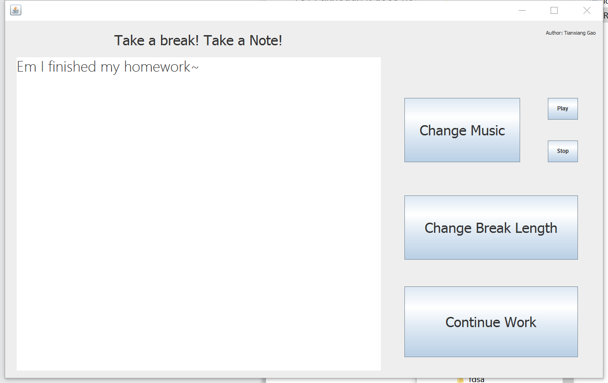
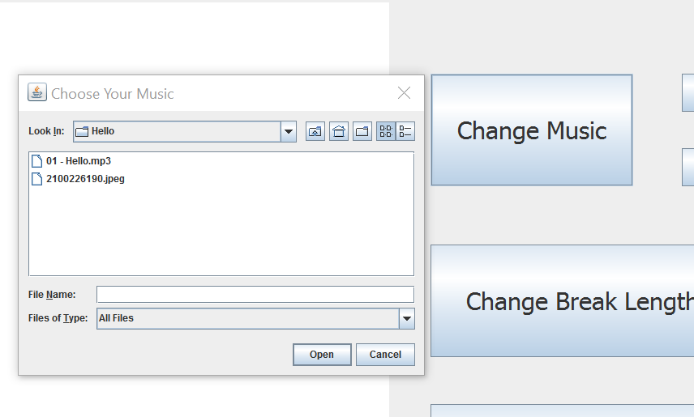
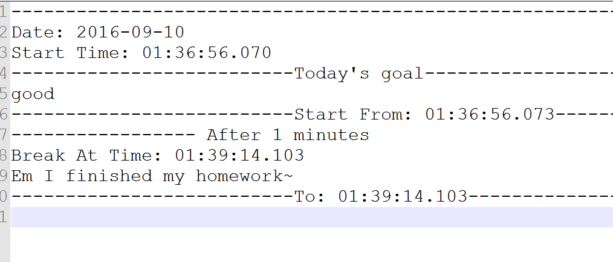
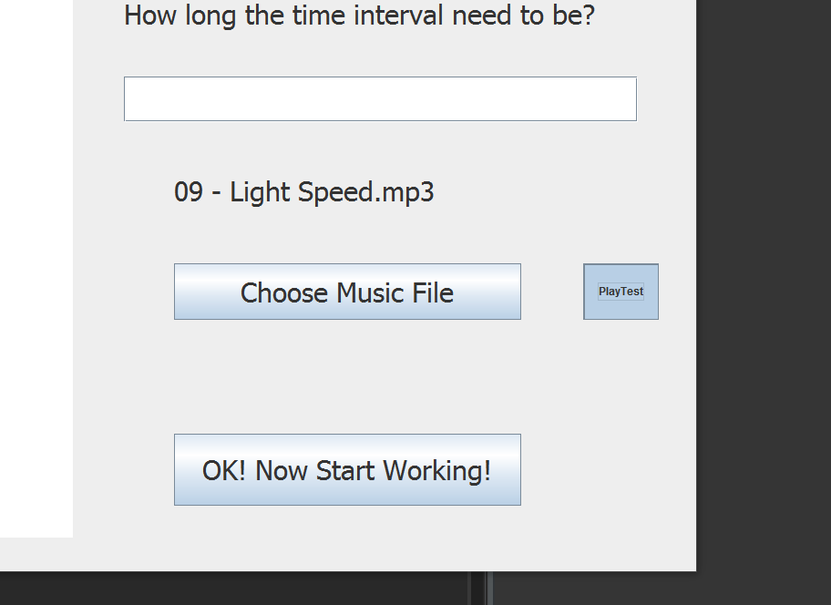

#Logger System
####initial time: 2016.9.5
####author: Tianxiang Gao
#####special thanks to lukeiscoding for suggesting windowbuilder, which saved my life from coding the frame.
#### inspried by Udacity's python course. But I need a more customized program for self-using.
**Project objective:** Build a log system to promote the working efficiency.

**Project basic idea:** Break the working schedule into time intervals. At the end of each time interval, a window jumps out and music plays. User need to record what he or she did in the previous time intervals. The program will automatic record the information into log, which is represented as text file named by the current date.

In brief, the program will work as following steps:

1. start the program.

1. pick up a song for each break to play

1. set up how long the intervals should be

1. start to run.

Then each time the window jumps out. User need to record what he or she has done in the prevous passed intervel. The program will write those into the log.

Language intended to use to implement: Java

Music format: MP3

Log format: text file

##Update 9.9

This small tool is aimed to break working time into time intervals and help user to record each interval's work.

Because I used JLayer to play the mp3 file, which is licenced under LGPL, so this program is also licenced under LGPL.

Please contact me if any question or improvement for this program is necessary for me to know.

My email is: zjcxgaoxing@gmail.com

Tianxiang Gao
2016.9.10
Ames, Iowa.


    This program is free software: you can redistribute it and/or modify
    it under the terms of the GNU General Public License as published by
    the Free Software Foundation, either version 3 of the License, or
    any later version.

    This program is distributed in the hope that it will be useful,
    but WITHOUT ANY WARRANTY; without even the implied warranty of
    MERCHANTABILITY or FITNESS FOR A PARTICULAR PURPOSE.  See the
    GNU General Public License for more details.

    You should have received a copy of the GNU General Public License
    along with this program.  If not, see <http://www.gnu.org/licenses/>.
		
##How to use it?

Download: RunnableJarFile.zip

https://github.com/PosFrank/Logger/blob/master/RunnableJarFile.7z

upzip the file and click into the folder.

double click logger.jar file.



First window: 

	1. set the time interval;
	
	2. set today's goal
	
	3. choose a music file (mp3 format)
	
	4. click "start to work" big button

Then after the time minutes you typed in the first window, the window will jumps out again and play the music at the same time.



you can do three thing on this window:

	1. take note what you have done
	

	
	2. change to another the music file to play (mp3 format)
	

	
	3. change the the length of time interval.


		
The program will automatically record the progress in the "notes" folder. Each day, the program will only generate one record file.

Close the program: Any time the window shows up, click the X button on the right-top window.

Enjoy~

##Design notes:

###Use cases

1. at the beginning of the program, a setting up window shows to set up three parameters:
*interval length

*music file

*today's work objective

2. begin from the start of the program, remindering window will jump out at the end of each time intervals.

3. each remindering window give 4 options:

* continue work

* record work progress.

* change interval length

* change music

so 4 button will shows and a music play window shows.

####Setting up window

1. one text field for setting how long the interval should be

2. one button to chooce the music file.

3. one test field for list today's goal.

####Remindering window

* Continue work  					->	Button

* record Work progress 		->	Button

* modify interval					->	Button

* modify music						->	Button

#####Record Work Progress

* Progress text						->	Text Field

* Save											->	Button

#####Modify interval

* interval length setting	->	Text Field

* save setting							->	Button

######Modify Music

* music choose							->	Dir Button

* save setting							->	Button

####Logic
```
-> set up time and music
	-> break
		-> continue
		-> record note
		-> change interval
		-> change music
```
##progress: 2016.9.7 Midnight

Thanks to http://stackoverflow.com/questions/12057214/jlayer-pause-and-resume-song

this guy killed the thread then resume the music from some points later than the pause point. But it's not a big deal to my project. Let's make the wheel running first. This one works, so I took it. Thanks.

Following is the new Main window:

This one looks decent.


click choose music file, then this dialoge jumps out.


we can use the three button to test play the music, to decide if we want them.


##progress: 2016.9.9 Almost finished. Next go into user test

I have finished all the feature on the design note. Next I will use this tool tomorrow to see which part I have make more imporve.

##progress: 2016.9.7

By using windowbuilder, things getting easier to organize those componenets.


we can also do a test play.



Problems need to be shoot:
1. music need to play on seperate thread, so that I can kill it during playing.
2. that's all for now.

##progress: 2016.9.5
first time to implement a swing GUI program. not very familiar with it. Spend some time do the initial learning. Get the first window as follow


useful resources:
[A Visual Guide to Swing](http://web.mit.edu/6.005/www/sp14/psets/ps4/java-6-tutorial/components.html)

this guy make some easy tutorials:
[enter link description here](https://www.youtube.com/user/Creativitytuts/playlists)
